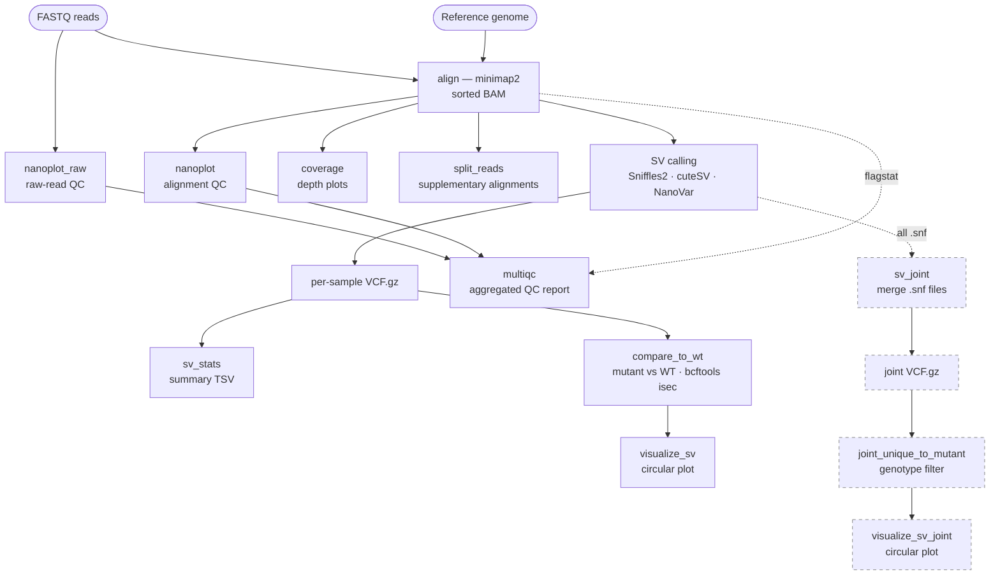

# snakemake-ont-sv

[](https://github.com/katkah/snakemake-ont-sv/actions/workflows/test.yml)

A Snakemake pipeline for structural variant (SV) detection from Oxford Nanopore long-read sequencing data. Supports three SV callers and produces per-sample statistics, cross-sample comparisons, and circular genome visualisations.

## Features

- **Three SV callers** — choose one per run: [Sniffles2](https://github.com/fritzsedlazeck/Sniffles), [NanoVar](https://github.com/cytham/nanovar), or [cuteSV](https://github.com/tjiangHIT/cuteSV)
- **Alignment** — minimap2 with ONT preset (`map-ont`)
- **QC** — NanoPlot reports for both raw reads and alignments, tinycov coverage plots, MultiQC summary
- **Cross-sample comparison** — mutant vs. wild-type using bcftools isec
- **SV statistics** — per-sample TSV summaries (type counts, size distributions)
- **Split-read detection** — supplementary alignment extraction, inter-chromosomal link coordinates
- **Circular visualisation** — SVG/PNG Circos-style plots via [pyCirclize](https://github.com/moshi4/pyCirclize) (BND, INV, DUP)
- **Sniffles2 joint calling** — optional population-level joint VCF from per-sample `.snf` files
- **Joint-genotyping comparison** — optional Sniffles2-only mutant-vs-WT plot derived from the joint genotypes (parallel to the isec comparison; fewer breakpoint-wobble false positives)
- **CI dry-run** — GitHub Actions tests the full DAG for all three callers on every push to any branch

## Pipeline overview



Most rules run **once per sample**; `compare_to_wt` / `visualize_sv` (and their joint
counterparts) run **per mutant** against the first WT sample; `multiqc` and `sv_joint`
run **once over all samples**. The **dashed** branch is optional — it runs only when
`sv_caller: sniffles2` **and** `sniffles2_joint_call: true`.

## Requirements

### Conda (one-time setup)

**[Miniforge](https://github.com/conda-forge/miniforge) is strongly recommended** over Miniconda or Anaconda.
It ships with the fast `libmamba` solver by default, uses `conda-forge` instead of `defaults`, and avoids licence issues.

```bash
# Install Miniforge (Linux x86-64)
wget https://github.com/conda-forge/miniforge/releases/latest/download/Miniforge3-Linux-x86_64.sh
bash Miniforge3-Linux-x86_64.sh
```

If you already have Miniconda/Anaconda, install the libmamba solver and set flexible channel priority:

```bash
conda install -n base conda-libmamba-solver
conda config --set solver libmamba
conda config --set channel_priority flexible
```

> **Why `channel_priority: flexible`?**
> Bioinformatics packages on bioconda (htslib, samtools, bcftools, sniffles) depend on older
> builds of shared libraries (e.g. libdeflate 1.25). When conda-forge ships a newer version
> (1.26+), `strict` priority excludes the bioconda builds entirely. `flexible` allows bioconda's
> builds to be used without conflicting with conda-forge packages.

### Snakemake

```bash
conda create -n snakemake -c bioconda -c conda-forge snakemake>=9
conda activate snakemake
```

All tool dependencies (minimap2, samtools, Sniffles2, NanoPlot, bcftools, etc.) are installed
**automatically** by Snakemake into isolated conda environments on first run — you do not install
them manually.

## Quick start

```bash
# 1. Clone the repository
git clone https://github.com/katkah/snakemake-ont-sv.git
cd snakemake-ont-sv

# 2. Create your config files from the templates
cp config/config.yaml.template config/config.yaml
cp config/samples.tsv.example  config/samples.tsv

# 3. Edit config/config.yaml — set your genome path and sample sheet
# Edit config/samples.tsv    — add your sample names, conditions, and FASTQ paths

# 4. Create the logs directory (gitignored, must exist before running)
mkdir -p logs

# 5. Run (from the repository root)
snakemake --snakefile workflow/Snakefile \
          --cores 8 \
          --software-deployment-method conda

# To use a different caller without editing config.yaml:
snakemake --snakefile workflow/Snakefile \
          --cores 8 \
          --software-deployment-method conda \
          --config sv_caller=cutesv
```

## Test data

A download script is provided to fetch public ONT data from SRA (C. elegans, ~3 GB):

```bash
bash test/download_test_data.sh
```

This downloads:
- **Mutant**: SRR11808611 — UA44 alpha-synuclein transgenic strain (~1.6 GB, ~16× coverage)
- **WT**: SRR11790534 — BY250 strain, first 400k reads subsampled (~300 MB, ~12× coverage)
- **Reference**: *C. elegans* WBcel235 genome from Ensembl release 112

After downloading, create `config/samples.tsv`:

```
sample_name	condition	fastq
wt_BY250	wt	test/test_data/wt_BY250.fastq.gz
mutant_UA44	mutant	test/test_data/mutant_UA44.fastq.gz
```

And set in `config/config.yaml`:
```yaml
genome:   test/test_data/ce11.fa
gap_file: test/test_data/gaps.bed
```

## Configuration

### `config/config.yaml`

| Key | Description | Example |
|---|---|---|
| `samples` | Path to sample sheet | `config/samples.tsv` |
| `genome` | Path to reference FASTA | `/data/genome/ce11.fa` |
| `gap_file` | BED file of assembly gaps (for NanoVar) | `/data/genome/gaps.bed` |
| `chromosomes` | Dict of chromosome names and sizes | see template |
| `sv_caller` | Which caller to use: `sniffles2`, `nanovar`, or `cutesv` | `sniffles2` |
| `min_sv_size` | Minimum SV size to report (bp) | `50` |
| `min_support_reads` | Minimum supporting reads | `3` |
| `exclude_chroms` | Chromosomes to exclude from split-read links | `["MtDNA"]` |
| `min_inv_size` | Minimum inversion size to visualise (bp) | `1000` |
| `min_dup_size` | Minimum duplication size to visualise (bp) | `1000` |
| `sniffles2_joint_call` | Enable multi-sample joint calling (Sniffles2 only) | `false` |
| `mem_mb` | Memory limits per rule (MB) — used by cluster schedulers | see template |

The `exclude_chroms` key accepts a list of chromosome names to exclude from split-read link detection. Mitochondrial DNA produces many split reads that are not informative for nuclear SV detection. The chromosome name varies by organism: `MtDNA` (C. elegans), `chrM` (human/mouse), `MT` (zebrafish).

See `config/config.yaml.template` for all options including per-tool thread counts.

### `config/samples.tsv`

Tab-separated, three columns:

```
sample_name	condition	fastq
WT_01	wt	/data/fastq/wt_01.fastq.gz
mutant_A	mutant	/data/fastq/mutant_a.fastq.gz
```

- `condition` must be `wt` or `mutant`
- At least one `wt` sample is required (used as reference in comparisons)
- Multiple mutant samples are supported

## Outputs

Results from each SV caller are stored in separate subdirectories so you can run all three callers on the same dataset without overwriting anything.

```
results/
├── qc/
│   ├── {sample}/NanoPlot-report.html          # per-sample read QC
│   └── {sample}/{sample}_coverage.png         # coverage plot
├── align/
│   └── {sample}/{sample}_sorted.bam           # sorted, indexed alignments
├── sv_calls/
│   └── {sv_caller}/{sample}/{sample}.vcf.gz   # per-sample SV calls
├── sv_joint/
│   └── {sv_caller}/joint.vcf.gz               # joint VCF (Sniffles2 only)
├── compare/
│   └── {sv_caller}/{sample}_vs_wt/
│       ├── unique_to_{sample}.vcf             # SVs private to mutant
│       ├── unique_to_wt.vcf                   # SVs private to WT
│       └── shared.vcf                         # shared SVs
├── compare_joint/                            # Sniffles2 + joint calling only
│   └── {sv_caller}/{sample}_vs_wt/
│       └── unique_to_{sample}_joint.vcf       # mutant-unique via joint genotypes
├── sv_stats/
│   └── {sv_caller}/{sample}_sv_summary.tsv    # SV type counts and sizes
├── split_reads/
│   └── {sample}/{sample}_split.bam            # supplementary alignments
├── visualize/
│   └── {sv_caller}/{sample}_sv.svg            # circular SV visualisation
├── visualize_joint/                          # Sniffles2 + joint calling only
│   └── {sv_caller}/{sample}_sv_joint.svg      # circular plot (joint-based)
└── multiqc/
    └── multiqc_report.html                    # aggregated QC report
```

To run all three callers sequentially:

```bash
for caller in sniffles2 cutesv nanovar; do
    snakemake --snakefile workflow/Snakefile \
              --cores 8 \
              --software-deployment-method conda \
              --config sv_caller=$caller
done
```

## SV caller comparison

| Caller | Strengths | Best for |
|---|---|---|
| **Sniffles2** | Highest precision (94%), joint calling, fast | Default choice; population studies |
| **NanoVar** | Works at low coverage (≥4×), neural network scoring | Low-coverage samples |
| **cuteSV** | Highest F1 score (82.5%), best sensitivity | Discovery; maximise recall |

## Known limitations

**Single WT sample.** The comparison step (`bcftools isec`) always uses the first WT sample
in `samples.tsv` as the reference. If you list multiple WT samples, all of them are aligned
and SV-called, but only the first is used in the mutant-vs-WT comparison. The others are
included in QC and MultiQC but silently excluded from the comparison.

If you have multiple WT samples the recommended workaround for now is to merge their VCFs
before running, or simply designate one representative WT sample and list it first.

## Running on HPC (PBS/Torque)

A ready-to-use PBS batch script is provided as `run_metacentrum.sh.template`.
Copy it, set the `STORAGE` variable to your site, and submit with `qsub run_metacentrum.sh`.
The real `run_metacentrum.sh` is gitignored so your personal paths are never committed.

### One-time environment setup (MetaCentrum)

Run inside an interactive job — do not install on the frontend:

```bash
# 1. Request an interactive job
qsub -I -l select=1:ncpus=2:mem=8gb -l walltime=2:00:00

# 2. Set your storage path (adjust site name: brno12-cerit, plzen1, etc.)
STORAGE="/storage/SITE/home/$USER"

# 3. Set conda package cache to shared storage BEFORE loading mambaforge
export CONDA_PKGS_DIRS="$STORAGE/tools/.conda/pkgs"
mkdir -p "$CONDA_PKGS_DIRS"

# 4. Load mambaforge
module add mambaforge

# 5. Create the snakemake environment in home storage (includes conda and mamba)
mamba create --prefix "$STORAGE/my_envs/snakemake" \
    -c bioconda -c conda-forge \
    "snakemake-minimal>=9" pandas conda mamba

# 6. Fix permissions so the env is accessible from all compute nodes
chmod -R u+rwX "$STORAGE/my_envs/snakemake"

# 7. Set conda channel priority (writes to ~/.condarc)
"$STORAGE/my_envs/snakemake/bin/conda" config --set channel_priority flexible
```

### Submitting the pipeline

```bash
cp run_metacentrum.sh.template run_metacentrum.sh
# Edit run_metacentrum.sh — set STORAGE to your actual site

qsub run_metacentrum.sh                        # default caller (sniffles2)
qsub -v SV_CALLER=cutesv run_metacentrum.sh    # override caller
```

`--conda-prefix` stores rule environments on persistent shared storage so they are reused across runs and projects.
`--shadow-prefix $SCRATCHDIR` uses node-local fast scratch for rule execution, avoiding slow cross-node storage I/O.

## Organism-specific notes

The pipeline is organism-agnostic. The `config.yaml.template` ships with chromosome sizes for
*C. elegans* (WBcel235/ce11) as an example. Replace the `chromosomes:` block with your
organism's assembly.

