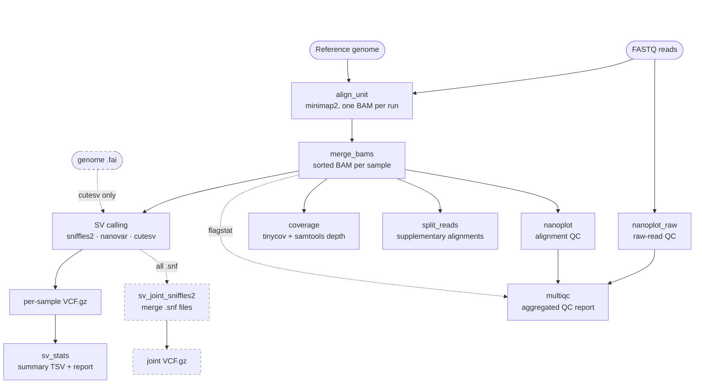
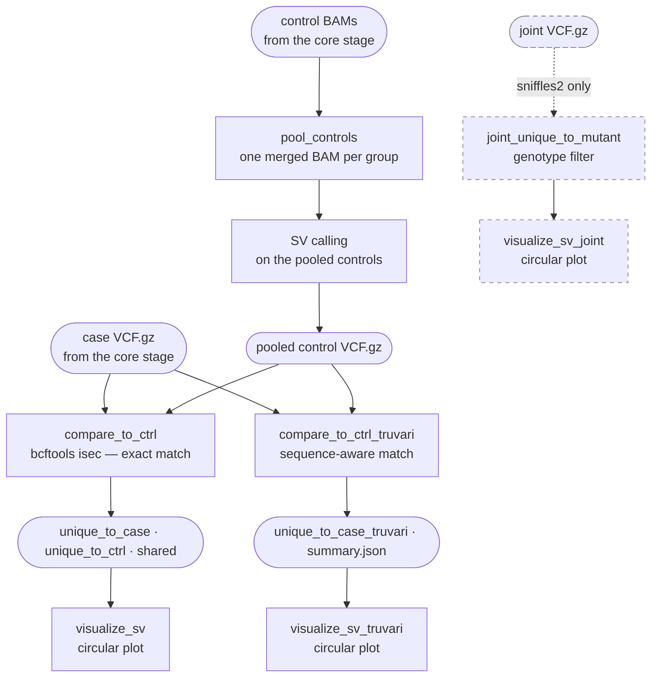

# snakemake-ont-sv

[](https://github.com/katkah/snakemake-ont-sv/actions/workflows/test.yml)

A Snakemake pipeline for structural variant (SV) detection from Oxford Nanopore long-read sequencing data. Supports three SV callers and produces per-sample statistics, cross-sample comparisons, and circular genome visualisations.

## Features

- **Three SV callers** — choose one per run: [Sniffles2](https://github.com/fritzsedlazeck/Sniffles), [NanoVar](https://github.com/cytham/nanovar), or [cuteSV](https://github.com/tjiangHIT/cuteSV)
- **Alignment** — minimap2 with ONT preset (`map-ont`)
- **QC** — NanoPlot reports for both raw reads and alignments, tinycov coverage plots, MultiQC summary
- **Cross-sample comparison** — mutant vs. wild-type by two methods: `bcftools isec` (exact position match) and [Truvari](https://github.com/ACEnglish/truvari) (tolerates breakpoint wobble and compares sequence)
- **Optional comparison stage** — `comparison.activate: false` runs alignment, QC and SV calling only, for datasets with no case/control design
- **SV statistics** — per-sample TSV summaries (type counts, size distributions)
- **Split-read detection** — supplementary alignment extraction, inter-chromosomal link coordinates
- **Circular visualisation** — SVG/PNG Circos-style plots via [pyCirclize](https://github.com/moshi4/pyCirclize) (BND, INV, DUP)
- **Sniffles2 joint calling** — optional population-level joint VCF from per-sample `.snf` files
- **Joint-genotyping comparison** — optional Sniffles2-only case-vs-control plot derived from the joint genotypes (parallel to the isec comparison; fewer breakpoint-wobble false positives)


## Pipeline overview

The pipeline has two stages. The **core stage** always runs. The
**comparison stage** — pooled controls, case-vs-control partitioning and circular
plots — runs only when `comparison.activate: true`.

### Core stage

Runs for every sample, with no knowledge of conditions or groups:



Every rule runs **once per sample**, except `align_unit` and `nanoplot_raw`
(once per sequencing run) and `multiqc` and `sv_joint_sniffles2` (once over all
samples). **Dashed** elements are caller-dependent:

| caller | joint calling | extra input | extra output |
|---|---|---|---|
| `sniffles2` | yes, if `sniffles2_joint_call: true` | — | `.snf` per sample |
| `nanovar` | not available | — | — |
| `cutesv` | not available | `<genome>.fai` must exist beside the FASTA | `cutesv_work/` per sample |

With `comparison.activate: false` this is the whole pipeline — nothing else
runs, and no rule ever compares one sample to another.

### Comparison stage

Runs only when `comparison.activate: true`, once per non-reference sample:



Each case sample is compared against **its own group's** pooled controls. The two
methods answer the same question differently: `isec`
matches on exact position and alleles, Truvari allows breakpoint wobble and
compares size and sequence, so a variant present in both samples at slightly
different coordinates is not reported as case-unique.

See [How samples are compared](#how-samples-are-compared) for what each method
can and cannot tell you.

## Requirements

### Conda (one-time setup)

**[Miniforge](https://github.com/conda-forge/miniforge) is strongly recommended** over Miniconda or Anaconda.
It ships with the fast `libmamba` solver by default, uses `conda-forge` instead of `defaults`, and avoids licence issues.

```bash
# Install Miniforge (Linux x86-64)
wget https://github.com/conda-forge/miniforge/releases/latest/download/Miniforge3-Linux-x86_64.sh
bash Miniforge3-Linux-x86_64.sh
```

If you already have Miniconda/Anaconda, install the libmamba solver and set flexible channel priority:

```bash
conda install -n base conda-libmamba-solver
conda config --set solver libmamba
conda config --set channel_priority flexible
```

> **Why `channel_priority: flexible`?**
> Bioinformatics packages on bioconda (htslib, samtools, bcftools, sniffles) depend on older
> builds of shared libraries (e.g. libdeflate 1.25). When conda-forge ships a newer version
> (1.26+), `strict` priority excludes the bioconda builds entirely. `flexible` allows bioconda's
> builds to be used without conflicting with conda-forge packages.

### Snakemake

```bash
conda create -n snakemake -c bioconda -c conda-forge snakemake>=9
conda activate snakemake
```

All tool dependencies (minimap2, samtools, Sniffles2, NanoPlot, bcftools, etc.) are installed
**automatically** by Snakemake into isolated conda environments on first run — you do not install
them manually.

## Quick start

```bash
# 1. Clone the repository
git clone https://github.com/katkah/snakemake-ont-sv.git
cd snakemake-ont-sv

# 2. Create your config files from the templates
cp config/config.yaml.template config/config.yaml
cp config/samples.tsv.example  config/samples.tsv
cp config/units.tsv.example    config/units.tsv

# 3. Edit config/config.yaml — set your genome path and comparison design
# Edit config/samples.tsv    — one row per sample: name, condition, group
# Edit config/units.tsv      — one row per sequencing run: sample, unit, FASTQ path

# 4. Only for sv_caller: cutesv — index the reference genome (one-time)
samtools faidx /path/to/genome/reference.fa

# 5. Run (from the repository root)
snakemake --snakefile workflow/Snakefile \
          --cores 8 \
          --software-deployment-method conda

# To use a different caller without editing config.yaml:
snakemake --snakefile workflow/Snakefile \
          --cores 8 \
          --software-deployment-method conda \
          --config sv_caller=cutesv
```

## Running from a project directory

The Quick start runs the pipeline from inside the clone, which writes `results/`
and `logs/` into the repository. For real work, keep the code in one clone and
give each dataset its own directory:

```
snakemake-ont-sv/                    code — one clone, updated with git pull
my-project/
├── config/
│   ├── config.yaml                  this project's settings
│   ├── samples.tsv
│   └── units.tsv
├── raw/                             or point units.tsv anywhere
└── results/ logs/ .snakemake/       created by the run
```

Run from the project directory, with an absolute path to the Snakefile:

```bash
cd /path/to/my-project

snakemake --snakefile /path/to/snakemake-ont-sv/workflow/Snakefile \
          --conda-prefix /path/to/snakemake-ont-sv/.snakemake/conda \
          --cores 8 \
          --software-deployment-method conda
```

Three things to know:

- **`results/`, `logs/` and `.snakemake/` are created in the working directory**,
  not beside the Snakefile. Everything a run produces stays with its data.
- **`config/config.yaml` is read relative to the working directory.** Keeping the
  `config/` subdirectory means it is found automatically; otherwise pass
  `--configfile` explicitly.
- **`--conda-prefix` points every project at one environment store.** Without it,
  Snakemake creates `.snakemake/conda/` inside each project and rebuilds all
  environments from scratch. Worth putting into a
  [profile](https://snakemake.readthedocs.io/en/stable/executing/cli.html#profiles)
  along with `--cores` and `--software-deployment-method`.

Paths inside `config.yaml` — `genome`, `gap_file`, `samples`, `units` — should be
absolute. They are resolved against the working directory, not against the
location of the config file.

Passing `--directory /path/to/my-project` from anywhere is equivalent, if you
prefer not to `cd` first.

## Test data

A download script is provided to fetch public ONT data from SRA (C. elegans, ~3 GB):

```bash
bash test/download_test_data.sh
```

This downloads:
- **Case**: SRR11808611 — UA44 alpha-synuclein transgenic strain (~1.6 GB, ~16× coverage)
- **Control**: SRR11790534 — BY250 strain, first 400k reads subsampled (~300 MB, ~12× coverage)
- **Reference**: *C. elegans* WBcel235 genome from Ensembl release 112

BY250 is the matched control here, not wild type — it carries its own integrated
`dat-1p::GFP` array. `ctrl` names the role, not the genotype.

After downloading, create `config/samples.tsv`:

```
sample_name	condition	group
ctrl_BY250	ctrl	group1
mutant_UA44	mutant	group1
```

and `config/units.tsv`:

```
sample_name	unit_name	fastq
ctrl_BY250	run1	test/test_data/ctrl_BY250.fastq.gz
mutant_UA44	run1	test/test_data/mutant_UA44.fastq.gz
```

And set in `config/config.yaml`:
```yaml
genome:   test/test_data/ce11.fa
gap_file: test/test_data/gaps.bed
```

If you plan to run with `sv_caller: cutesv`, index the reference as well:
```bash
samtools faidx test/test_data/ce11.fa
```

## Configuration

### `config/config.yaml`

| Key | Description | Example |
|---|---|---|
| `samples` | Path to sample sheet | `config/samples.tsv` |
| `genome` | Path to reference FASTA — index with `samtools faidx` if using `cutesv` | `/data/genome/ce11.fa` |
| `gap_file` | BED file of assembly gaps (for NanoVar) | `/data/genome/gaps.bed` |
| `chromosomes` | Dict of chromosome names and sizes | see template |
| `sv_caller` | Which caller to use: `sniffles2`, `nanovar`, or `cutesv` | `sniffles2` |
| `min_sv_size` | Minimum SV size to report (bp) | `50` |
| `min_support_reads` | Minimum supporting reads | `3` |
| `exclude_chroms` | Chromosomes to exclude from split-read links | `["MtDNA"]` |
| `min_inv_size` | Minimum inversion size to visualise (bp) | `1000` |
| `min_dup_size` | Minimum duplication size to visualise (bp) | `1000` |
| `sniffles2_joint_call` | Enable multi-sample joint calling (Sniffles2 only) | `false` |
| `mem_mb` | Memory limits per rule (MB) — used by cluster schedulers | see template |

The `exclude_chroms` key accepts a list of chromosome names to exclude from split-read link detection. Mitochondrial DNA produces many split reads that are not informative for nuclear SV detection. The chromosome name varies by organism: `MtDNA` (C. elegans), `chrM` (human/mouse), `MT` (zebrafish).

See `config/config.yaml.template` for all options including per-tool thread counts.

### `config/samples.tsv`

One row per biological sample. Tab-separated:

```
sample_name	condition	group
ctrl_01	ctrl	group1
ctrl_02	ctrl	group1
mutant_A	mutant	group1
```

- `sample_name` — unique, and must also appear in `units.tsv`
- `condition` — the experimental factor. The *column name* comes from
  `comparison.variable` in `config.yaml` and the baseline level from
  `comparison.reference`; `condition`/`ctrl` are just the defaults
- `group` — which samples are compared with which: every non-reference sample is
  compared against the reference samples sharing its group

### `config/units.tsv`

One row per sequencing run. A sample sequenced twice gets two rows, and the runs
are merged after alignment. Biological replicates are **not** units — they are
separate samples sharing a group.

```
sample_name	unit_name	fastq
ctrl_01	run1	/data/fastq/ctrl_01.fastq.gz
ctrl_02	run1	/data/fastq/ctrl_02.fastq.gz
ctrl_02	run2	/data/fastq/ctrl_02_rerun.fastq.gz
```

> Both sheets must be **tab**-separated. Spaces are not column separators, and
> the resulting error is misleading — e.g. `comparison.reference = 'ctrl' does
> not appear in column 'condition'` when the values look perfectly correct.

## Outputs

Results from each SV caller are stored in separate subdirectories so you can run all three callers on the same dataset without overwriting anything.

```
results/
├── qc/
│   ├── {sample}/NanoPlot-report.html          # per-sample read QC
│   └── {sample}/{sample}_coverage.png         # coverage plot
├── align/
│   └── {sample}/{sample}_sorted.bam           # sorted, indexed alignments
├── sv_calls/
│   └── {sv_caller}/{sample}/{sample}.vcf.gz   # per-sample SV calls
├── sv_joint/
│   └── {sv_caller}/joint.vcf.gz               # joint VCF (Sniffles2 only)
├── compare/
│   └── {sv_caller}/{sample}_vs_ctrl/
│       ├── unique_to_{sample}.vcf             # SVs private to the case sample
│       ├── unique_to_ctrl.vcf                 # SVs private to the controls
│       └── shared.vcf                         # shared SVs
├── compare_joint/                            # Sniffles2 + joint calling only
│   └── {sv_caller}/{sample}_vs_ctrl/
│       └── unique_to_{sample}_joint.vcf       # case-unique via joint genotypes
├── sv_stats/
│   └── {sv_caller}/{sample}_sv_summary.tsv    # SV type counts and sizes
├── split_reads/
│   └── {sample}/{sample}_split.bam            # supplementary alignments
├── visualize/
│   └── {sv_caller}/{sample}_sv.svg            # circular SV visualisation
├── visualize_joint/                          # Sniffles2 + joint calling only
│   └── {sv_caller}/{sample}_sv_joint.svg      # circular plot (joint-based)
└── multiqc/
    └── multiqc_report.html                    # aggregated QC report
```

To run all three callers sequentially:

```bash
for caller in sniffles2 cutesv nanovar; do
    snakemake --snakefile workflow/Snakefile \
              --cores 8 \
              --software-deployment-method conda \
              --config sv_caller=$caller
done
```

## SV caller comparison

| Caller | Strengths | Best for |
|---|---|---|
| **Sniffles2** | Highest precision (94%), joint calling, fast | Default choice; population studies |
| **NanoVar** | Works at low coverage (≥4×), neural network scoring | Low-coverage samples |
| **cuteSV** | Highest F1 score (82.5%), best sensitivity | Discovery; maximise recall |

## How samples are compared

Every non-reference sample is compared against the reference samples sharing its `group`.
What that means depends on the method:

| method | baseline | reads genotypes? |
|---|---|---|
| `bcftools isec` | pooled controls | no — presence/absence |
| Truvari | pooled controls | no — presence/absence |
| joint genotyping | each control separately | yes |

For isec and Truvari, the group's reference samples are merged into one pooled control BAM
(`results/align/{group}_controls/`) and SV-called as a single sample. Pooling is valid for
these two because they only ask whether a variant is *present* in the baseline, and it
multiplies control coverage so the baseline callset is comparable in depth to the case
sample.

Joint calling does not use the pool — it needs per-sample genotype columns, so it reads each
control's `.snf` separately and keeps a site only where the case is non-reference and *every*
control is confidently `0/0`. No read is counted twice.

## Known limitations

**isec and Truvari cannot distinguish "absent" from "not called".** Both compare presence
and absence only. A variant that is genuinely present in the controls but too weakly
supported to be called there will show up as mutant-unique. Joint genotyping is the only
method that separates the two, because it re-genotypes every sample at a merged site list.

**Joint calling is Sniffles2-only.** With `sv_caller: nanovar` or `cutesv` you get the isec
and Truvari comparisons, but no joint path.

**Sniffles2 joint calling drops breakends.** `sniffles --input *.snf` (combine mode) emits no
`SVTYPE=BND` records at all, although per-sample calling does. In our test data that removed
two thirds of the mutant's calls — 1054 of 1587 — so the joint comparison covers DEL, INS,
INV and DUP only. If breakends matter for your question, read them from the isec or Truvari
output, which are built from the per-sample VCFs and retain them.

**Pooled controls lose per-control detail.** In the isec and Truvari outputs there is no way
to see which individual control carried a variant — the pool is one sample. Use the joint
path for that, or open `results/align/{group}_controls/` in IGV: the per-unit read groups
survive the merge, so reads stay traceable to the animal they came from.

## Running on HPC (PBS/Torque)

A ready-to-use PBS batch script is provided as `run_metacentrum.sh.template`.
Copy it, set the `STORAGE` variable to your site, and submit with `qsub run_metacentrum.sh`.
The real `run_metacentrum.sh` is gitignored so your personal paths are never committed.

### One-time environment setup (MetaCentrum)

Run inside an interactive job — do not install on the frontend:

```bash
# 1. Request an interactive job
qsub -I -l select=1:ncpus=2:mem=8gb -l walltime=2:00:00

# 2. Set your storage path (adjust site name: brno12-cerit, plzen1, etc.)
STORAGE="/storage/SITE/home/$USER"

# 3. Set conda package cache to shared storage BEFORE loading mambaforge
export CONDA_PKGS_DIRS="$STORAGE/tools/.conda/pkgs"
mkdir -p "$CONDA_PKGS_DIRS"

# 4. Load mambaforge
module add mambaforge

# 5. Create the snakemake environment in home storage (includes conda and mamba)
mamba create --prefix "$STORAGE/my_envs/snakemake" \
    -c bioconda -c conda-forge \
    "snakemake-minimal>=9" pandas conda mamba

# 6. Fix permissions so the env is accessible from all compute nodes
chmod -R u+rwX "$STORAGE/my_envs/snakemake"

# 7. Set conda channel priority (writes to ~/.condarc)
"$STORAGE/my_envs/snakemake/bin/conda" config --set channel_priority flexible
```

### Submitting the pipeline

```bash
cp run_metacentrum.sh.template run_metacentrum.sh
# Edit run_metacentrum.sh — set STORAGE to your actual site

qsub run_metacentrum.sh                        # default caller (sniffles2)
qsub -v SV_CALLER=cutesv run_metacentrum.sh    # override caller
```

`--conda-prefix` stores rule environments on persistent shared storage so they are reused across runs and projects.
`--shadow-prefix $SCRATCHDIR` uses node-local fast scratch for rule execution, avoiding slow cross-node storage I/O.

## Organism-specific notes

The pipeline is organism-agnostic. The `config.yaml.template` ships with chromosome sizes for
*C. elegans* (WBcel235/ce11) as an example. Replace the `chromosomes:` block with your
organism's assembly.

